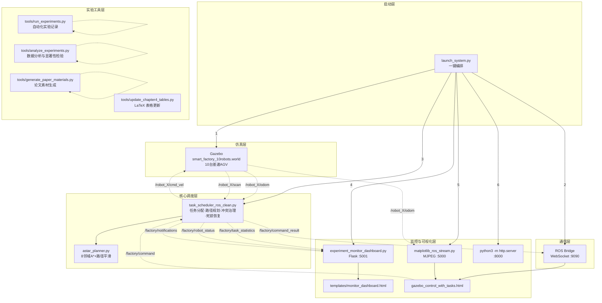
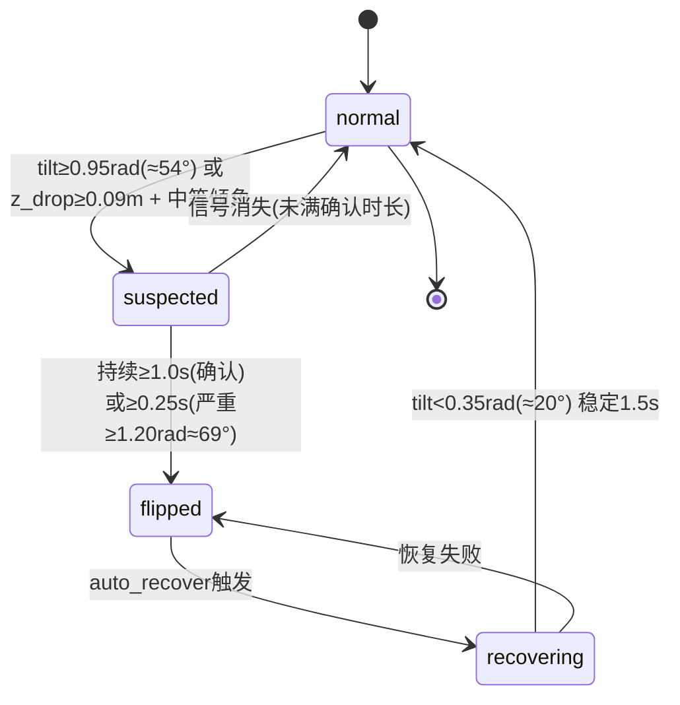
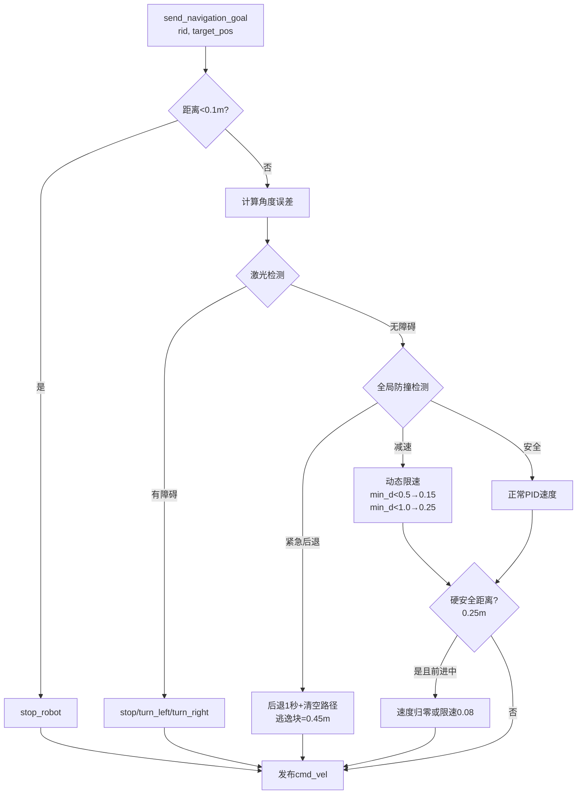
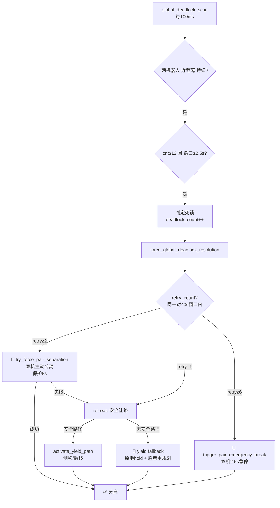
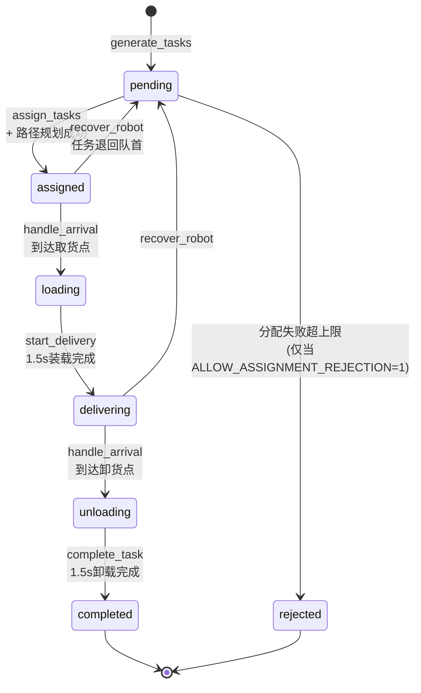
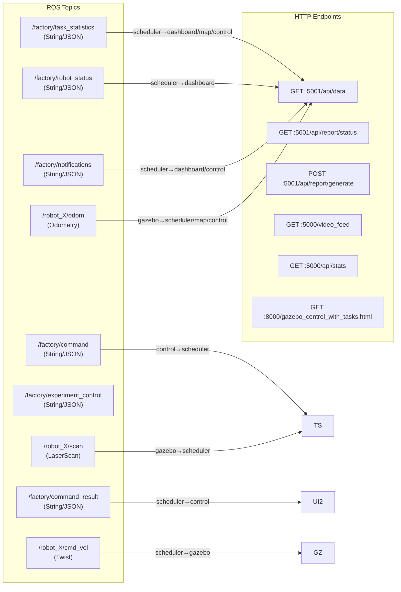

# 智能工厂多机器人调度系统 —— 完整逻辑文档（按启动顺序，函数级细化）

> **适用范围**：本仓库全部代码模块。  
> **阅读方式**：按 launch_system.py 的启动顺序组织，先架构总览，再逐模块函数级解释。  
> **配套英文版**：`SYSTEM_LOGIC.md`（同步更新）。

---

## 0. 架构总览



---

## 1. 启动链路总览


环境变量传递链：
```
launch_system.py
  ├─ EXPERIMENT_MODE    → task_scheduler_ros_clean.py + experiment_monitor_dashboard.py
  ├─ ALGORITHM_MODE     → task_scheduler_ros_clean.py
  ├─ ABLATION_MODE      → task_scheduler_ros_clean.py
  └─ TEST_ID            → task_scheduler_ros_clean.py
```

---

## 2. 模块一：launch_system.py（启动器）

**文件路径**：`launch_system.py` | **类名**：`SmartFactorySystem` | **总行数**：约 1176 行

### 2.1 类结构与初始化

| 方法 | 职责 |
|------|------|
| `__init__()` | 确定 base_dir，初始化 processes/terminals/headless |
| `log(msg, level)` | 统一日志输出，按级别加 emoji（✅/⚠️/❌/📍） |
| `check_port(port)` | TCP connect 检测端口是否被占用 |
| `kill_port(port)` | psutil 精确杀端口进程，失败用 lsof 备用 |
| `check_process(name)` | pgrep -f 模糊匹配进程存活 |
| `kill_process(name)` | pkill -f / pkill -9 -f 两阶段终止 |
| `launch_service_command(svc_name, title, shell_cmd)` | 按 headless 模式用 Popen，否则用 gnome-terminal --tab |
| `cleanup_old_processes()` | 清理 6 个已知脚本 + 释放端口 5000/5001/8000/9090 |

### 2.2 服务启动方法

| 方法 | 关键逻辑 |
|------|----------|
| `start_roscore()` | 检测 rosmaster 存活则跳过；否则启动，轮询 15 秒等待 |
| `start_gazebo()` | roslaunch smart_factory_10_robots.launch，等待 15 秒后继续（不阻塞） |
| `start_rosbridge()` | 先等待 8 秒检测 Gazebo launch 是否已自带 rosbridge；否则手动启动，轮询 10 秒 |
| `start_task_scheduler_with_mode(mode, algorithm, test_id, ablation_mode)` | 1) 解析算法模式别名（rule_greedy→naive 等）2) 验证消融模式仅对 proposed/full 生效 3) 设环境变量并启动脚本 |
| `start_task_scheduler()` | 无实验模式版本（实际未使用） |
| `start_dashboard(experiment_mode, algorithm_mode)` | 设 env 后 Popen 启动，轮询 15 秒等待端口 |
| `start_map_visualization()` | 检测 + 启动 matplotlib_ros_stream.py |
| `start_web_server()` | 启动 python3 -m http.server 8000 |

### 2.3 系统管理与运行

| 方法 | 关键逻辑 |
|------|----------|
| `open_web_pages()` | 依次打开 Dashboard(5001) 和控制面板(8000)，失败用 xdg-open |
| `verify_system()` | 逐项检查 rosmaster/gzserver/rosbridge/scheduler/端口 |
| `cleanup(signum, frame)` | SIGINT/SIGTERM 处理器，逆序终止 processes，pkill 清理 |
| `run(preset_mode, preset_algorithm, preset_ablation, auto_yes, open_browser, headless)` | **主函数**：菜单选择 → 清理 → 启动 7 服务 → 验证 → 开浏览器 → 监控循环 |
| `main()` | argparse 解析 CLI 参数，调用 run() |

### 2.4 全局常量

| 常量 | 值 | 说明 |
|------|-----|------|
| `COLLISION_ESCAPE_BLOCK_DISTANCE` | 0.45m（环境变量可覆盖） | 避障逃逸块距离 |
| `FREEZE_WINDOW_SECONDS` | 1800.0s（环境变量可覆盖） | 系统冻结检测窗口 |

### 2.5 模式映射表

```python
mode_map = {
    'minimal': 'Minimal Test',       # 19 任务
    'quick': 'Quick Test',           # 40 任务
    'baseline': 'Baseline Test',     # 79 任务
    'stress': 'Stress Test',         # 316 任务
    'monitor': 'Monitoring Mode',    # 监控模式
    's2_core': 'S2 Core Comparison', # S2 核心对比
}
algorithm_map = {
    'naive': 'Naive',
    'path_only': 'Path Only',
    'path_reservation': 'Path+Reservation',
    'full': 'Full System',
    'proposed': 'Proposed',
    'rule_greedy': 'Rule-based (Greedy)',
    'cbs_based': 'CBS-based',
    'auction_based': 'Auction-based',
}
```

### 2.6 CLI 参数

| 参数 | 类型 | 说明 |
|------|------|------|
| `--mode` | str | 实验模式：minimal/quick/baseline/baseline2/stress/stress2/monitor/s2_core/s2_realtime/s2_congestion/s2_peak |
| `--algorithm` | str | 算法模式：naive/path_only/path_reservation/full/rule_greedy/cbs_based/auction_based/proposed |
| `--ablation` | str | 消融模式：A0/A1/A2/A3/A4（仅对 proposed/full 生效） |
| `--no-browser` | flag | 禁止自动打开浏览器 |
| `--yes` | flag | 自动确认重启已有服务 |
| `--headless` | flag | 无图形终端模式（全部后台 Popen 运行） |

### 2.7 run() 内部执行流

```
1. 打印 banner，注册信号处理器
2. 检测 gnome-terminal 可用性
3. 实验模式选择（交互式 7 选 1 或 CLI preset）
4. 算法模式选择（交互式 8 选 1 或 CLI preset）
5. 消融模式选择（仅 proposed/full 且用户明确选择时，交互式 5 选 1）
6. 检测旧 ROS 进程，可选重启
7. cleanup_old_processes()
8. 按 1/7~7/7 顺序启动所有服务
9. 等待 5 秒稳定
10. verify_system()
11. open_web_pages()
12. 打印使用说明
13. 进入 while True 监控循环（每 5 秒检查 rosmaster）
14. Ctrl+C → cleanup()
```

---

## 3. 模块二：task_scheduler_ros_clean.py（调度核心）

**文件路径**：`task_scheduler_ros_clean.py` | **类名**：`CleanTaskScheduler` | **总行数**：约 2847 行

### 3.1 数据结构

| 数据结构 | 说明 |
|----------|------|
| `TaskType` 枚举 | EMPTY_TO_CARDING / GREEN_TO_DRAWING1 / YELLOW_TO_DRAWING2 / RED_TO_COMPLETED |
| `RobotStatus` 枚举 | IDLE / MOVING / LOADING / UNLOADING / YIELDING / MANUAL / PAUSED |
| `Task` 数据类 | 任务 ID、类型、源点/终点、优先级、分配机器人、状态时间戳、`assign_fail_count`、`last_assign_attempt_time`、`next_assign_attempt_time`、`last_assign_attempt_robot` |

### 3.2 CleanTaskScheduler.__init__() 初始化全貌

```
参数层：
  - 机器人数量 num_robots=10
  - 出生点 robot_spawn_positions（10 个 3D 坐标）

避障参数：
  - collision_check_distance=1.5m（减速检测距离）
  - hard_safety_distance=0.25m（强制停止距离）
  - critical_safety_distance=0.15m（紧急后退距离）
  - collision_escape_block_distance=0.45m（逃逸块距离，环境变量 COLLISION_ESCAPE_BLOCK_DISTANCE）
  - laser_obstacle_threshold=0.5m（激光触发距离）

死锁检测参数：
  - stuck_detection_window=2.5s（卡住判定窗口）
  - stuck_distance_threshold=0.33m（距离阈值）
  - stuck_trigger_count=12（最小触发次数）
  - deadlock_resolve_cooldown=12s（解锁冷却）
  - deadlock_release_distance=0.80m（分离判定距离）
  - deadlock_retry_window=40.0s（同一机器人对重复死锁计数窗口）

双机强制分离与紧急刹停参数：
  - pair_separation_hold_sec=8.0s（双机分离保护时长）
  - pair_separation_active（正在执行的分离对 + 保护截止时间）
  - yield_pair_cooldown_sec=2.5s（普通让路动作去抖冷却）
  - yield_repeat_window=12.0s（同一机器人重复让路统计窗口）
  - max_consecutive_yield_same_peer=3（连续对同 peer 让路阈值）

走廊令牌参数：
  - corridor_token_ttl=6.0s（令牌有效时长）
  - corridor_log_throttle_sec=2.0s（令牌日志限频）

时空预约参数：
  - reservation_horizon=8.0s（预约窗口）
  - reservation_grid_size=0.6m（预约栅格）
  - reservation_time_tolerance=0.8s（冲突容忍）

优先级参数：
  - wait_boost_interval=2.0s（等待增益步长）
  - wait_boost_step=6（每步加分）
  - max_wait_priority_boost=36（增益上限）
  - priority_inheritance_bonus=15（对方让路继承加分）
  - protected_priority_bonus=8（保护状态加分）
  - wait_speed_threshold=0.03m/s（判定等待的速度阈值）

翻倒检测参数：
  - flip_tilt_confirm_rad=0.95（约 54°，确认阈值）
  - flip_tilt_severe_rad=1.20（约 69°，严重阈值）
  - flip_tilt_clear_rad=0.35（约 20°，清除翻倒的稳定倾角阈值）
  - flip_z_drop_threshold=0.09m（相对基线高度下降阈值）
  - flip_z_baseline_alpha=0.03（高度基线 EMA 更新系数）
  - flip_z_min_samples=20（启用高度辅助判据前的最小样本数）
  - flip_confirm_duration=1.0s（疑似持续多久才判定翻倒）
  - flip_clear_duration=1.5s（信号消失后稳定多久清除翻倒）
  - flip_repeat_suppress_duration=12.0s（连续确认翻倒抑制窗口）
  - flip_recover_cooldown=8.0s（自动恢复冷却）

任务分配容错参数：
  - allow_assignment_rejection（环境变量 ALLOW_ASSIGNMENT_REJECTION，默认 0/关闭）
  - max_assignment_fail_retries=80（环境变量 MAX_ASSIGNMENT_FAIL_RETRIES）
  - assignment_retry_backoff_base=0.5s（环境变量 ASSIGNMENT_RETRY_BACKOFF_BASE）
  - assignment_retry_backoff_max=8.0s（环境变量 ASSIGNMENT_RETRY_BACKOFF_MAX）

冻结与流窗口分析参数：
  - freeze_window_seconds=1800s（环境变量 FREEZE_WINDOW_SECONDS，系统级停滞检测）
  - persistent_stall_horizon=8.0s（环境变量 PERSISTENT_STALL_HORIZON，单车卡住自愈阈值）
  - stall_near_target_tolerance=0.75m（环境变量 STALL_NEAR_TARGET_TOLERANCE，近目标容忍）
  - stall_replan_cooldown=3.0s（环境变量 STALL_REPLAN_COOLDOWN，重规划冷却）
  - freeze_detection_grace=10.0s（环境变量 FREEZE_DETECTION_GRACE，启动后冻结检测宽限期）
  - freeze_effective_robot_threshold=1（环境变量 FREEZE_EFFECTIVE_ROBOT_THRESHOLD，冻结判定最小活跃机器人数）
  - flow_window_seconds=5.0s（环境变量 FLOW_WINDOW_SECONDS，微吞吐窗口）

到达拥挤处理参数：
  - arrival_crowded_cooldown（到达拥挤处理冷却 {rid: until}）
  - arrival_crowded_retry（到达拥挤连续重试次数 {rid: int}）

算法模式解析：
  ALGORITHM_MODE → algorithm_mode (naive/path_only/path_reservation/full)
  ABLATION_MODE → ablation_mode (A0~A4)
  消融开关：
    A1 → enable_spacetime_reservation=False
    A2 → enable_deadlock_scan=False
    A3 → enable_fairness=False
    A4 → enable_progressive_recovery=False

ROS 发布者（每个机器人一个 cmd_vel）：
  /robot_{i}/cmd_vel (Twist)
  /factory/task_statistics (String/JSON)
  /factory/robot_status (String/JSON)
  /factory/notifications (String/JSON)
  /factory/command_result (String/JSON)

ROS 订阅者：
  /robot_{i}/odom (Odometry)
  /robot_{i}/scan (LaserScan)
  /factory/command (String/JSON)
  /factory/experiment_control (String/JSON)

自动启动：
  若 EXPERIMENT_MODE 存在 → experiment_started=True → generate_tasks() → 开始执行
```

### 3.3 区域与分散策略

| 函数 | 逻辑 |
|------|------|
| `update_region_tracking()` | 清空 region_robots，遍历所有机器人位置重新归类 |
| `get_region_name_for_position(pos)` | 计算到各区域中心的归一化距离（dist/radius），取最小者 |
| `find_dispersed_goal_in_region(region_name, preferred_goal)` | 8 方向 × 4 距离采样候选点，选离区域内其他机器人最远的 |
| `plan_path_avoiding_region_robots(robot_id, start, goal)` | 临时将起点/终点区域内的其他机器人加入动态障碍 → 规划 → 恢复 |

### 3.4 走廊单向令牌系统

工厂中存在 3 个狭窄走廊区域（按 bbox 定义），同一时间仅允许单向通行。通过令牌（Token）机制仲裁对向冲突。

| 函数 | 逻辑 |
|------|------|
| `get_corridor_for_position(pos)` | 按 bbox 检测坐标是否在 3 个走廊区域内 |
| `get_robot_corridor_state(rid)` | 根据下一路径点方向判断机器人前进方向符号（+1/-1），不在走廊返回 (None, 0) |
| `cleanup_corridor_tokens()` | 遍历所有令牌：过期(TTL=6s)/持有者消失/持有者离开走廊 → 释放。更新 release_count |
| `corridor_priority_decision(r1, r2)` | 1) 双方同走廊且方向相反 → 2) 有令牌按 holder 放行（复用命中 +1）3) 无令牌按有效优先级授予（grant +1）。返回 True 表示 r1 应让路给 r2 |
| `_corridor_log(key, message, level)` | 限频日志输出（corridor_log_throttle_sec=2s 去抖） |

**令牌生命周期**：
```
授予(grant) → 持有者通行中 → 复用命中(reuse) → 过期/离开 → 释放(release)
  TTL=6s        同方向放行        反方向放行      6s到期或持有者消失
```

**令牌统计指标**：
- `corridor_token_grant_count_total`：新令牌授予次数
- `corridor_token_reuse_count_total`：已有令牌复用命中次数
- `corridor_token_release_count_total`：令牌释放次数

### 3.5 ROS 回调函数

| 函数 | 逻辑 |
|------|------|
| `odom_callback(msg, robot_id)` | 更新位置/速度/朝向 → 累计行驶距离 → 翻倒状态机 → 更新 A* 动态障碍（仅非 IDLE 机器人） |
| `laser_callback(msg, robot_id)` | 存储 LaserScan ranges |
| `get_planning_dynamic_obstacles()` | 返回非 IDLE 或有任务的机器人位置字典 |

### 3.6 翻倒检测状态机



| 函数 | 逻辑 |
|------|------|
| `update_upright_z_baseline(rid, pos_z, roll, pitch)` | 在"稳定直立"状态下 EMA 更新高度基线（α=0.03），需 ≥20 样本后启用高度辅助判据 |
| `detect_flip_signal(rid, roll, pitch, pos_z)` | 倾角主判据（tilt≥0.95rad 确认 / tilt≥1.20rad 严重）+ 高度下降辅助判据（z_drop≥0.09m） |
| `update_flip_state(...)` | 完整状态机，含去抖（疑似持续确认）、重复抑制（12s 窗口）、稳定清除（1.5s 稳定观察） |
| `auto_recover_flipped_robots()` | 遍历 flipped 状态机器人 → 启动恢复线程（冷却 8s，防重入） |
| `_auto_recover_worker(rid)` | 调用 recover_robot() → 发布 command_result → 标记 recovering 状态 → 清除 recovering 标记 |

**翻倒检测双判据体系**：
1. **倾角主判据**：roll/pitch 合成倾角，0.95rad(≈54°) 确认，1.20rad(≈69°) 严重
2. **高度辅助判据**：相对 EMA 基线高度下降 ≥0.09m，配合中等倾角使用
3. **去抖机制**：疑似状态需持续 1.0s 才确认翻倒；严重信号仅需 0.25s
4. **重复抑制**：连续确认翻倒 12s 窗口内抑制重复告警
5. **恢复清除**：tilt<0.35rad(≈20°) 持续 1.5s 清除翻倒状态

### 3.7 导航控制与三层防护



| 函数 | 逻辑 |
|------|------|
| `send_navigation_goal(robot_id, target_pos)` | PID 航向控制 + 3 层防护（激光层、全局防撞层、硬安全层） |
| `check_collision_nearby(robot_id)` | 返回 (has_coll, speed_factor, emg_stop)。三级判定：critical(≤0.15m)→紧急后退(逃逸块 0.45m)；hard(≤0.25m)→零速/限速 0.08；collision_check(≤1.5m)→按距离比例降速 |
| `check_laser_obstacle(robot_id)` | 将 360° laser scan 分 3 段（左/前/右各 120°），前方受阻(≤0.5m)时按左右空间选转向方向 |

### 3.8 优先级与反饥饿机制

| 函数 | 逻辑 |
|------|------|
| `update_robot_priority(robot_id)` | 基础优先级：delivering +20，loading/unloading +10 |
| `update_robot_wait_state(rid)` | MOVING 有路径但速度 < 0.03m/s → 记录等待起始时间 |
| `get_wait_duration(rid)` | 返回连续等待秒数 |
| `get_effective_priority(rid, peer_id)` | **有效优先级 = 基础 + wait_boost + 保护加分 + 对方让路继承加分** |
| `get_task_phase_target(task)` | assigned → task.source，delivering → task.destination |
| `recover_stalled_robots()` | 等待 > persistent_stall_horizon 的处理：近目标 → 强制到达；远目标 → 节流重规划 |
| `is_yielding_to(rid, target_id)` | 检查 rid 当前是否在让路给 target_id |

**wait_boost 计算公式**：
$$P_i^{eff}=P_i^{base} + \min(36,\ \lfloor\frac{t_{wait}}{2.0}\rfloor \times 6) + 8\cdot\mathbb{1}[protected] + 15\cdot\mathbb{1}[peer\_yielding\_to\_me]$$

**反饥饿触发条件**：wait_boost > 0 导致优先级反转时记录 starvation_prevent_count。

### 3.9 死锁检测与处置升级链



| 函数 | 逻辑 |
|------|------|
| `global_deadlock_scan()` | 双循环遍历所有机器人对，跟踪近距离持续时间。跳过正在分离保护期(8s)和冷却期(2.5s)中的 pair |
| `force_global_deadlock_resolution(r1, r2, retry_count)` | **渐进式升级**：走廊优先 → 有效优先级裁决 → retry=1 安全让路 → retry≥2 双机分离 → retry≥6 紧急刹停 |
| `try_plan_safe_yield_path(rid, avoid_rid, hold_seconds, lateral_offsets, backward_offsets)` | 采样侧向/后向候选点，逐个验证安全性并规划 |
| `_plan_escape_path(rid, other_id, ...)` | 生成远离 other_id 的脱困路径 |
| `activate_yield_path(rid, target_id, path, hold_until)` | 激活让路路径并标记 YIELDING 状态 + 保护标记 |
| `try_force_pair_separation(r1, r2, retry_count)` | 双机各规划脱困路径，同时执行。成功后设 8s 保护期（pair_separation_active） |
| `trigger_pair_emergency_break(r1, r2, hold_sec)` | 双机急停 + 清空预约 + 标记冷却（仅 retry≥6 时触发） |
| `execute_yield_action(r1, r2)` | 让路动作：冷却去抖(2.5s) → 连续让路升级(同peer≥3次 within 12s触发) → 安全侧移 → fallback |

**渐进式恢复策略（Progressive Recovery）**：

| 级别 | 触发条件 | 动作 | 说明 |
|------|----------|------|------|
| L1 | 首次死锁（retry=1） | 安全让路（侧移/后移） | 标准冲突解决 |
| L2 | 重复死锁（retry≥2） | 双机强制分离 | 各规划脱困路径，同时执行，保护 8s |
| L3 | 高频死锁（retry≥6） | 双机紧急刹停 2.5s | 清空预约 + 硬停 + 冷却 |

**让路升级链（Yield Escalation）**：

| 级别 | 触发条件 | 动作 |
|------|----------|------|
| 正常让路 | 优先级裁决 + 安全路径存在 | activate_yield_path（侧移/后移） |
| 连续让路 | 同 peer 连续 ≥3 次 within 12s | 强制分离或降级处理 |
| 回退 | 无安全路径 | yield fallback：原地 hold + 胜者重规划 |
| 冷却 | 刚让路过 2.5s 内 | 跳过让路，防止振荡 |

### 3.10 时空预约系统

| 函数 | 逻辑 |
|------|------|
| `reserve_spacetime(robot_id, path)` | 沿路径计算每段到达时间，生成 (gx, gy, t) 节点预约 + (gx1,gy1,gx2,gy2,t0,t1) 边预约 |
| `clear_spacetime_reservation(rid)` | 清除预约（用于重规划/让路后） |
| `check_spacetime_conflict(robot_id)` | 3 类冲突检测：1) 节点冲突（同格 + 时间近邻）2) 对向换边 3) 同向同边 |
| `detect_conflict_type(r1, r2)` | 分析冲突几何类型：following/perpendicular/opposite/diagonal |
| `resolve_conflict_by_priority(r1, r2)` | 结合冲突类型 + 有效优先级 + 走廊令牌 决定让路方 |

### 3.11 任务分配

| 函数 | 逻辑 |
|------|------|
| `generate_tasks(mode)` | 按模式设定 task_type_targets，按固定比例 36:36:6:1 生成具随机源/终点的任务队列 |
| `assign_tasks()` | 仅 experiment_started=True 执行；遍历 IDLE 机器人 → pop 任务 → 分散目标 → 规划路径 → 激活任务 |
| `pop_assignable_task(attempted_task_ids, now)` | 跳过本周期已尝试 + 处于 backoff（next_assign_attempt_time > now）的任务 |
| `record_assignment_failure(task, rid)` | 递增 fail_count → 计算退避时间 → 设 next_assign_attempt_time。若 fail_count > max(80) 且 ALLOW_ASSIGNMENT_REJECTION=1 则永久拒绝 |
| `get_assignment_retry_backoff(fail_count)` | **指数退避公式**：$backoff = \min(8.0,\ 0.5 \times 1.5^{fail\_count})$，按 num_robots 归一化 |

**任务生成详情（所有模式）**：
| 模式 | EMPTY→CARD | GREEN→DRAW1 | YELLOW→DRAW2 | RED→COMP | 合计 |
|------|-----------|-------------|-------------|----------|------|
| minimal | 8 | 8 | 2 | 1 | 19 |
| quick | 18 | 18 | 3 | 1 | 40 |
| baseline | 36 | 36 | 6 | 1 | 79 |
| stress | 144 | 144 | 24 | 4 | 316 |

**stress 模式详细坐标**：
| 任务类型 | 源点 | 终点（随机采样范围） | 优先级 |
|----------|------|---------------------|--------|
| empty_to_carding | empty_storage (2.0, 2.0) | carding_waiting (5.0, 1.5~8.5) | 65 |
| green_to_drawing1 | green_storage (2.0, 8.0) | drawing1_waiting (8.0, 2.5/6.5) | 65 |
| yellow_to_drawing2 | yellow_storage (14.0, 2.0) | drawing2_waiting (10.8, 2.5/6.5) | 75 |
| red_to_completed | red_storage (14.0, 8.0) | completed (14.0, 5.0) | 100 |

**任务分配容错流**：
```
IDLE 机器人 → pop_assignable_task（跳过 backoff 中的任务）
    → find_dispersed_goal_in_region（区域分散）
    → A* plan_path（含 avoid_region_robots）
    → 规划成功 → 激活任务（assigned 状态）
    → 规划失败 → record_assignment_failure → backoff / 永久拒绝
```

### 3.12 任务生命周期状态机



### 3.13 导航执行与到达处理

| 函数 | 逻辑 |
|------|------|
| `navigate_along_path(rid)` | **每台机器人每帧调用**：1)MANUAL 等待检查 2)PAUSED 跳过 3)让路有路径→导航，无路径→等待 4)路径空→到达判定或重规划 5)非让路→预约+冲突检测 6)逐点 pop 已到达的近点 7)发导航目标 |
| `cleanup_runtime_navigation_states()` | 清除非导航状态的陈旧预约和过期让路 |
| `handle_arrival(rid)` | **拥挤检查**（min_d < 0.35m → 尝试侧移/分散/后退）→ **状态切换**（assigned→loading / delivering→unloading） |

### 3.14 任务状态流转

| 函数 | 逻辑 |
|------|------|
| `get_timer_bound_task(rid, expected_task_id, expected_status, action_name)` | 校验定时器回调的 task ID、status、active_tasks 绑定，防止过期回调误操作 |
| `start_delivery(rid, expected_task_id)` | loading → delivering，规划到目的路径 |
| `complete_task(rid, expected_task_id)` | unloading → completed，更新统计，释放机器人 |
| `stop_robot(rid)` | 发布零速 Twist |

### 3.15 统计发布

| 函数 | 逻辑 |
|------|------|
| `publish_statistics()` | 构建完整 JSON（含 makespan、throughput、Gini、deadlock 比率、算法元数据等）→ 发布 /factory/task_statistics + 各机器人 /factory/robot_status |
| `get_robot_display_state(rid)` | 前端展示状态：优先显示 flipped/recovering |
| `send_notification(level, message)` | 发布 /factory/notifications |
| `publish_command_result(command, status, message, robot_id, source, reason, request_id)` | 结构化 /factory/command_result |

### 3.16 Web 指令处理

| 指令 | 触发函数 | 逻辑 |
|------|----------|------|
| `manual_dispatch` | `execute_manual_dispatch()` | 退回当前任务 → 规划到指定坐标 → 进入 MANUAL 状态 |
| `recover_robot` | `recover_robot()` | Gazebo 传送 + 状态重置 + 3s 保护 |
| `stop_robot` | `pause_robot()` | 保存快照 → 停止 → PAUSED |
| `resume_robot` | `resume_robot()` | 从快照重规划路径 → MOVING |
| `recover_all` | `recover_robot()` × 10 | 批量恢复 |

### 3.17 主循环 run() — 10Hz 精确顺序

```
while not rospy.is_shutdown():
    1. check_completion()              # 完成检测，all idle 且 terminal≥total → 退出
    2. cleanup_corridor_tokens()        # 走廊令牌回收
    3. cleanup_runtime_navigation_states()  # 清理陈旧预约与让路
    4. assign_tasks()                   # 空闲机器人分配任务
    5. update_region_tracking()         # 区域追踪
    6. global_deadlock_scan()           # 死锁扫描
    7. auto_recover_flipped_robots()    # 翻倒自动恢复
    8. check_manual_tasks()             # 人工任务等待计时
    9. for each robot: update_robot_wait_state()  # 等待状态更新
    10. recover_stalled_robots()        # 单车卡住自愈
    11. for each MOVING/MANUAL/YIELDING: navigate_along_path()  # 导航执行
    12. update_cycle_metrics()          # 周期性能统计
    13. publish_statistics()            # 发布统计数据
    rate.sleep()                        # 10Hz
```

### 3.18 冻结与流窗口分析（Freeze & Flow Window）

系统持续监控全局任务进度，当出现「冻结」（长时间无任务完成）时记录冻结持续时长；同时以滑动窗口评估微吞吐（流窗口），为鲁棒性评估提供量化指标。

| 函数 | 逻辑 |
|------|------|
| `update_cycle_metrics()` | 每周期调用：记录计算耗时（总/最大/<100ms 计数）→ 检测任务完成进度停滞 → 累加冻结时长 → 更新流窗口（5s 窗口内是否新完成任务） |
| `recover_stalled_robots()` | 单车级卡住自愈：等待 > persistent_stall_horizon(8s) 且距离上次重规划 > stall_replan_cooldown(3s) → 近目标(≤0.75m)强制到达 / 远目标节流重规划 |

**冻结判定逻辑**：
1. 距上次进度更新 ≥ freeze_detection_grace(10s) 后开始检测
2. `last_completed_task_count` 未变化 → 累加 freeze_duration_total
3. 活跃机器人（非 IDLE） ≥ freeze_effective_robot_threshold(1) 时才计入
4. 记录 freeze_duration_samples 时间戳序列

**流窗口（Flow Window）判定**：
1. 每 flow_window_seconds(5s) 一个窗口
2. 窗口内有新任务完成 → positive；无 → negative
3. 统计 flow_positive_count_total / flow_total_window_count
4. 输出 flow_window_outcomes 序列

**指标发布**（在 publish_statistics 中输出）：
- `freeze_duration_total`：累计冻结时长（秒）
- `freeze_duration_samples`：冻结事件时间序列
- `flow_positive_ratio`：正流窗口比例
- `persistent_stall_duration_total`：单车卡住累计时长（秒）
- `persistent_stall_duration_samples`：卡住事件时间序列

### 3.19 到达拥挤处理（Arrival Crowding）

机器人在到达取货点/卸货点时，若检测到附近有其他机器人过于靠近（min_d < 0.35m），触发拥挤疏散机制。

| 函数 | 逻辑 |
|------|------|
| `handle_arrival(rid)` | **前置拥挤检查** → min_d < 0.35m 时：1) 尝试侧移 2) 尝试分散目标 3) 后退等待（冷却期内不重复触发）→ 通过后正常状态切换 |

**拥挤处理参数**：
- 触发距离：0.35m
- 冷却机制：arrival_crowded_cooldown（防重复触发）
- 重试计数：arrival_crowded_retry（跟踪连续拥挤）

### 3.20 计算周期性能监控

每周期记录调度循环的计算耗时，用于评估算法实时性。

| 指标 | 说明 |
|------|------|
| `computation_time_total` | 累计计算耗时（秒） |
| `computation_time_max` | 单周期最大耗时（秒） |
| `computation_cycle_count` | 总周期数 |
| `computation_cycle_lt_100ms_count` | <100ms 的周期数 |
| `computation_cycle_timestamps` | 周期时间戳序列（含是否 <100ms 标志） |

### 3.21 完整指标清单

| 类别 | 指标 | 说明 |
|------|------|------|
| 死锁 | `deadlock_count_total` | 死锁判定次数 |
| 死锁 | `deadlock_event_timestamps` | 死锁触发时间戳序列 |
| 死锁 | `deadlock_resolution_action_timestamps` | 处置动作时间戳序列 |
| 死锁 | `deadlock_pair_retry_count` | 每对机器人死锁重试次数 |
| 让路 | `yield_count_total` | 让路动作总次数 |
| 让路 | `yield_fallback_count_total` | 让路回退 hold 次数 |
| 让路 | `robot_yield_count` | 每台机器人让路次数 |
| 分离 | `pair_forced_separation_count_total` | 双机强制分离次数 |
| 分离 | `pair_emergency_break_count_total` | 双机紧急刹停次数 |
| 恢复 | `recovery_count_total` | 成功恢复次数 |
| 恢复 | `recovery_trigger_count_total` | 恢复触发次数 |
| 碰撞 | `collision_event_count` | 碰撞风险事件次数 |
| 碰撞 | `collision_event_timestamps` | 碰撞事件时间戳序列 |
| 碰撞 | `collision_intervention_timestamps` | 碰撞干预时间戳序列 |
| 饥饿 | `starvation_prevent_count_total` | 反饥饿触发次数 |
| 分配 | `assignment_reject_attempts_total` | 路径规划失败次数 |
| 分配 | `rejected_task_count_total` | 永久拒绝任务数 |
| 走廊 | `corridor_token_grant_count_total` | 令牌授予次数 |
| 走廊 | `corridor_token_reuse_count_total` | 令牌复用命中次数 |
| 走廊 | `corridor_token_release_count_total` | 令牌释放次数 |
| 翻倒 | `robot_flip_count` | 每台机器人翻倒次数 |
| 消息 | `notification_count_total` | 通知消息数 |
| 消息 | `command_result_count_total` | 命令结果消息数 |
| 消息 | `task_stats_publish_count_total` | 统计发布次数 |
| 消息 | `robot_status_publish_count_total` | 状态发布次数 |
| 冻结 | `freeze_duration_total` | 累计冻结时长 |
| 冻结 | `freeze_duration_samples` | 冻结事件时间序列 |
| 流 | `flow_positive_count_total` | 正流窗口数 |
| 流 | `flow_total_window_count` | 总窗口数 |
| 流 | `flow_window_outcomes` | 窗口结果序列 |
| 停滞 | `persistent_stall_duration_total` | 单车卡住累计时长 |
| 停滞 | `persistent_stall_duration_samples` | 卡住事件时间序列 |
| 计算 | `computation_time_total` | 累计计算耗时 |
| 计算 | `computation_time_max` | 单周期最大耗时 |
| 计算 | `computation_cycle_lt_100ms_count` | <100ms 的周期数 |

---

## 4. 模块三：astar_planner.py（路径规划）

**文件路径**：`astar_planner.py` | **类名**：`Node`、`AStarPlanner` | **总行数**：约 336 行

### 4.1 Node 类

| 方法 | 逻辑 |
|------|------|
| `__init__(x, y, g, h, parent)` | 保存网格坐标、实际代价 g、启发式 h、总代价 f、父节点。使用 `__slots__` 优化内存 |
| `__lt__(other)` | f 值小者优先（用于 heapq） |
| `__eq__(other)` | 按坐标判等 |
| `__hash__()` | 按坐标哈希（用于 closed_set） |

### 4.2 AStarPlanner 类

| 方法 | 逻辑 |
|------|------|
| `__init__(grid_size=0.1, robot_radius=0.0625)` | 地图 16×10m，8 方向（直线代价 1.0，对角 1.414），线程锁 |
| `set_obstacles(obstacles)` | 设置静态障碍列表 |
| `update_dynamic_obstacles(robot_positions)` | 线程安全更新动态障碍 |
| `heuristic(node, goal)` | 欧氏距离 |
| `is_valid(x, y, ignore_robot_id)` | **3 层检查**：边界（0.1m 边距）→ 静态障碍（碰撞圆）→ 动态障碍（safe_dist = 8×robot_radius = 0.5m） |
| `world_to_grid(x, y)` | int(x/grid_size), int(y/grid_size) |
| `grid_to_world(gx, gy)` | gx×grid_size, gy×grid_size |
| `plan_path(start, goal, robot_id, priority)` | **核心 A\***：起点合法性检查 → 坐标转换 → open_list(heapq) + closed_set → 8 方向扩展 → 最大 3000 迭代 → 到达容差 2 格(0.2m) → 回溯路径 |
| `reconstruct_path(node)` | 沿 parent 回溯 → 翻转 → 返回栅格坐标序列 |
| `find_nearest_valid_point(point, robot_id)` | 以 0.1m 步长向外扩圈搜索（0.1~0.5m，32 方向采样），返回最近合法点 |
| `smooth_path(path)` | 基于可视性的线段简化：从起点尽可能连远端可视点 |
| `is_line_clear(p1, p2)` | 沿直线等间距采样，逐点 is_valid |

---

## 5. 模块四：experiment_monitor_dashboard.py（Dashboard 后端）

**文件路径**：`experiment_monitor_dashboard.py` | **框架**：Flask + CORS | **端口**：5001 | **总行数**：约 332 行

### 5.1 核心数据结构

```python
dashboard_data = {
    'task_stats': {     # /factory/task_statistics 回调填充
        total_tasks, completed_tasks, pending_tasks, in_progress_tasks,
        rejected_tasks, terminal_tasks, elapsed_time, completion_rate,
        task_completion_rate_pct, avg_task_time, throughput_per_min,
        makespan, deadlock_resolution_ratio, total_travel_distance,
        load_balance_gini, deadlock_count, yield_count, collision_count,
        recovery_count, scalability_robot_count, scalability_task_count, ...
    },
    'robot_stats': {},   # {robot_id: {status, position, current_task, tasks_completed, distance}}
    'events': [],         # 最新在前，最多 50 条
    'system_status': 'INITIALIZING',  # INITIALIZING / WAITING_ROS / RUNNING / ERROR
    'experiment_mode': os.environ.get('EXPERIMENT_MODE'),
    'algorithm_mode': os.environ.get('ALGORITHM_MODE'),
    'last_update': datetime_str,
    'report_status': { generating, generated, generated_at, duration_sec, trigger_source, auto_triggered, message }
}
```

### 5.2 核心函数

| 函数 | 逻辑 |
|------|------|
| `is_experiment_completed_unlocked()` | terminal(completed+rejected) ≥ total 且 pending≤0 且 in_progress≤0（需 data_lock 保护） |
| `run_report_generation(trigger_source)` | subprocess 调用 tools/generate_paper_materials.py，超时 180s |
| `start_report_generation(trigger_source)` | 防重入检查（report_lock + generating 标志）→ 启动后台线程 |
| `task_statistics_callback(msg)` | 更新 task_stats → 检测自动完成（含 auto_triggered 去重）→ 触发 auto report |
| `robot_status_callback(msg)` | 更新单个机器人状态 |
| `notification_callback(msg)` | 插入事件（最多 50 条） |
| `ros_thread_func()` | ROS 连接循环（60s 重试，disable_signals=True 避免与 Flask 冲突）→ 订阅 3 个话题 → 10Hz rate.sleep() 循环 |

### 5.3 Flask 路由

| 路由 | 方法 | 功能 |
|------|------|------|
| `/` | GET | render_template('monitor_dashboard.html') |
| `/api/data` | GET | 返回 dashboard_data 完整 JSON |
| `/api/report/status` | GET | 返回完成状态 + report_status |
| `/api/report/generate` | POST | 触发报告生成（仅实验完成后） |

---

## 6. 模块五：templates/monitor_dashboard.html（Dashboard 前端）

**文件路径**：`templates/monitor_dashboard.html` | **总行数**：约 490 行 | **刷新频率**：每 2 秒 AJAX

### 6.1 布局结构

```
┌─────────────────────────────────────────┐
│ Header: 实验模式 + 算法模式 + 状态横幅    │
├─────────────────────────────────────────┤
│ 统计卡片 (4+4+5+2+2)                    │
│ 总任务/已完成/耗时/完成率                 │
│ 死锁/让路/恢复/碰撞                      │
│ 吞吐量/平均任务时间                       │
│ Makespan/行驶距离/Gini/机器人/任务        │
│ 成功率/死锁解决率                         │
├─────────────────────────────────────────┤
│ 进度条                                   │
├─────────────────────────────────────────┤
│ 机器人状态 (10 卡片网格)                  │
├─────────────────────────────────────────┤
│ 事件日志 (最多 20 条)                    │
├─────────────────────────────────────────┤
│ 报告生成按钮 + 状态                      │
└─────────────────────────────────────────┘
```

### 6.2 JavaScript 核心函数

| 函数 | 逻辑 |
|------|------|
| `updateDashboard()` | fetch /api/data → 更新所有 DOM 元素，含防抖（updateInFlight） |
| `generateReport()` | confirm → POST /api/report/generate |
| `toNumber(value, fallback)` | 安全类型转换 |

---

## 7. 模块六：matplotlib_ros_stream.py（2D 地图流）

**文件路径**：`matplotlib_ros_stream.py` | **框架**：Matplotlib + Flask | **端口**：5000 | **总行数**：约 580 行

### 7.1 核心函数

| 函数 | 逻辑 |
|------|------|
| `start_ros_subscribers()` | 初始化 ROS 节点 → 订阅 10 个机器人 odom + /factory/task_statistics → 启动数据流监控线程 |
| `monitor_data_flow()` | 每 5 秒打印在线机器人数和消息速率 |
| `odom_callback(msg, robot_id)` | 更新位置/朝向/速度 → 追加路径点（deque maxlen=150） |
| `task_stats_callback(msg)` | 更新 experiment_stats |
| `detect_robot_area(x, y)` | 归一化距离匹配 31 个工厂区域 |
| `pick_contrast_text_color(hex)` | 根据背景亮度返回黑/白文本色 |
| `generate_factory_map()` | **核心渲染**：创建 16×10 画布(1600×1000px) → 画 31 个区域圆 → 画 10 个机器人（圆形+箭头+状态灯+速度文本+轨迹）→ 输出 PNG → MJPEG 字节 |

### 7.2 机器人可视化元素

| 元素 | 参数 |
|------|------|
| 机器人圆形 | radius=0.0625m |
| 方向箭头 | length=0.08m |
| 状态指示灯 | radius=0.0175m |
| 颜色方案 | 10 色（#FF6B6B, #4ECDC4, ... #52B788） |
| 状态颜色 | IDLE=#2196F3, MOVING=#4CAF50, LOADING=#FFC107, UNLOADING=#FF9800, BLOCKED=#F44336 |

### 7.3 Flask 路由

| 路由 | 功能 |
|------|------|
| `/video_feed` | MJPEG 流，content-type=multipart/x-mixed-replace |
| `/api/stats` | 返回 experiment_stats JSON |
| `/` | 说明页面 |

---

## 8. 模块七：gazebo_control_with_tasks.html（Web 控制面板）

**文件路径**：`gazebo_control_with_tasks.html` | **通信方式**：WebSocket → rosbridge :9090 | **总行数**：约 735 行

### 8.1 布局结构（左右分栏）

```
┌──────────────┬───────────────────────────┐
│ 左侧 (370px) │ 右侧 (flex)               │
│              │                           │
│ 系统状态      │ 2D 地图                   │
│ 实时统计卡片   │ (MJPEG :5000/video_feed) │
│ 任务完成统计   │                           │
│ 工厂区域图例   │                           │
│ 当前任务列表   │                           │
│ 机器人状态网格  │                           │
│ 系统日志       │                           │
│ 人工调度面板   │                           │
│              │                           │
│              │ 控制按钮                   │
│              │ [Start] [Stop] [Reset]    │
└──────────────┴───────────────────────────┘
```

### 8.2 JavaScript 核心函数

| 函数 | 逻辑 |
|------|------|
| `connectToROS()` | WebSocket 连接 rosbridge(:9090)，失败 5s 重连 |
| `subscribeToTopics()` | advertise /factory/command → subscribe /factory/task_statistics + /factory/robot_status + /factory/notifications + /factory/command_result + 10 个 /robot_X/odom |
| `handleROSMessage(data)` | 按 topic 分发到 updateTaskStatistics / handleCommandResult / handleSchedulerNotification / updateRobotState |
| `updateTaskStatistics(stats)` | 更新模式检测（total_tasks 推断或 experiment_mode 字段）→ 进度条 → 任务目标同步 |
| `renderTaskList(stats)` | 渲染活跃任务列表 |
| `updateRobotState(robotId, odomMsg)` | 合并 odom 和 scheduler 状态 |
| `updateRobotGrid()` | 渲染 10 机器人卡片（2×5 网格，含恢复/停止按钮） |
| `startMatplotlibStream()` | 设置 img src 指向 :5000/video_feed |
| `recoverRobot(robotId)` | publish /factory/command recover_robot |
| `stopRobot(robotId)` | publish /factory/command stop_robot |
| `resumeRobot(robotId)` | publish /factory/command resume_robot |
| `sendManualCommand()` | 校验坐标边界(0~16, 0~10) → publish /factory/command manual_dispatch |
| `loadExperimentMode()` | fetch Dashboard API(:5001/api/data) 同步模式，每 3s 周期性纠偏 |

### 8.3 模式推断逻辑

```javascript
MODE_TASK_TARGETS = {
    'minimal': {empty_to_carding: 8, green_to_drawing1: 8, yellow_to_drawing2: 2, red_to_completed: 1},
    'quick': {empty_to_carding: 18, green_to_drawing1: 18, yellow_to_drawing2: 3, red_to_completed: 1},
    'baseline': {empty_to_carding: 36, green_to_drawing1: 36, yellow_to_drawing2: 6, red_to_completed: 1},
    'stress': {empty_to_carding: 144, green_to_drawing1: 144, yellow_to_drawing2: 24, red_to_completed: 4}
}
```
模式优先从 scheduler 上报的 `task_type_targets` 匹配，其次从 `experiment_mode` 字段，兜底按 `total_tasks` 值推断。

---

## 9. 模块八：tools/run_experiments.py（实验自动化）

**文件路径**：`tools/run_experiments.py` | **总行数**：约 583 行

### 9.1 模块级常量

| 常量 | 作用 |
|------|------|
| `EXPERIMENT_MODE_NORMALIZATION` | baseline2→baseline，stress2→stress，s2_* 映射 |
| `ALGORITHM_MODE_NORMALIZATION` | rule_greedy→naive，cbs_based→path_reservation，auction_based→path_only 等 |
| `ALGORITHM_FAMILY_LABEL` | 显示名称映射（Proposed, Rule-based (Greedy), CBS-based, Auction-based） |
| `METRIC_WHITELIST_421` | 论文 4.2.1 指标白名单（8 项）：completion_rate, makespan, throughput, deadlock_count, deadlock_ratio, collision_count, distance, gini |

### 9.2 ExperimentRecorder 类

| 方法 | 逻辑 |
|------|------|
| `__init__(experiment_name, output_dir, report_dir)` | 创建时间戳实验目录 → ROS 订阅 → 初始化 metrics 字典 |
| `stats_callback(msg)` | 更新 8 项白名单指标 + robot_utilization + task_completion_distribution |
| `notification_callback(msg)` | 追加事件日志 |
| `odom_callback(msg, robot_id)` | 追加轨迹点 (time, x, y, z) |
| `calculate_total_distance()` | 对 10 机器人轨迹求和 |
| `save_raw_data()` | 导出 task_statistics.csv / event_log.csv / robot_*_trajectory.csv |
| `generate_summary()` | 导出 summary.json + single_run_metrics.csv + 追加 algorithm_comparison_summary.csv |
| `plot_results()` | 2×2 子图：任务进度 / 类型分布饼图 / 机器人利用率 / 关键指标汇总 |
| `print_summary()` | 终端打印汇总 |

### 9.3 ExperimentRunner 类

| 方法 | 逻辑 |
|------|------|
| `run_baseline_experiment(repeat=3)` | 循环运行 n 次 → 保存 + 汇总 |
| `generate_multi_run_comparison(results, exp_name)` | 聚合多次运行统计（mean/std/min/max） |
| `run_load_test()` / `run_robustness_test()` / `run_pause_resume()` / `run_comparison()` / `run_realtime()` | 6 种实验类型（部分占位） |

**输出文件结构**：
```
experiment_results/
├── EXPERIMENT_NAME_TIMESTAMP/
│   ├── task_statistics.csv
│   ├── event_log.csv
│   ├── robot_0_trajectory.csv ... robot_9_trajectory.csv
│   ├── summary.json
│   ├── single_run_metrics.csv
│   └── results_plot.png
```

---

## 10. 模块九：tools/analyze_experiments.py（数据分析）

**文件路径**：`tools/analyze_experiments.py` | **总行数**：约 563 行

### 10.1 ExperimentAnalyzer 类

| 方法 | 逻辑 |
|------|------|
| `__init__(results_dir)` | 扫描 experiment_results/*/summary.json |
| `load_experiments()` | 加载所有 summary.json，extract exp_dir/exp_name |
| `infer_group(exp_name)` | 根据名称关键词分组（before_keys: before/old/legacy/naive; after_keys: after/new/refactor/improved/baseline_run） |
| `permutation_test(mean_a, mean_b, pooled, n_a, n_b, iterations=5000)` | 双侧置换检验，加一平滑，p<0.05 显著 |
| `run_significance_analysis(...)` | Before vs After 的 8 指标显著性分析，输出 CSV + MD |
| `compare_experiments(...)` | 生成对比 CSV + 2×4 柱状图 |
| `generate_statistics_table(...)` | 输出均值/标准差/最小值/最大值/中位数表 |
| `plot_trajectory(...)` | 绘制机器人轨迹 X-Y 图 |
| `generate_latex_table(...)` | DataFrame → LaTeX |
| `generate_full_report(...)` | HTML 报告 |

**输出文件**：
- `significance_before_after.csv` / `.md` — 显著性检验结果
- `comparison_*.csv` / `comparison_plot_*.png` — 对比数据与图
- `statistics_*.csv` — 描述性统计
- `experiment_report.html` — 完整 HTML 报告

---

## 11. 模块十：tools/generate_paper_materials.py（论文素材）

**文件路径**：`tools/generate_paper_materials.py` | **总行数**：约 850+ 行

### 11.1 PaperMaterialGenerator 类

| 方法 | 逻辑 |
|------|------|
| `load_baseline_data()` | 加载 baseline_run* 目录的 summary.json |
| `load_all_experiment_data()` | 加载全部实验 summary |
| `generate_table1_baseline(data)` | 表 1：基准性能（完成时间/死锁/避让/饥饿/利用率）→ CSV + LaTeX |
| `generate_comparison_data()` | 表 2：算法对比（完成时间/死锁/碰撞/相对提升）→ CSV + LaTeX |
| `generate_table3_fairness_comparison()` | 表 3：公平性对比（完成时间/死锁/避让/饥饿/利用率 CV）→ CSV + LaTeX |
| `generate_figure1_progress()` | 图 1：任务完成进度曲线（最多 3 条 run） |
| `generate_figure2_comparison(df)` | 图 2：算法性能对比 3 面板柱状图 |
| `generate_figure3_utilization(data)` | 图 3：机器人利用率分布（含误差棒） |
| `load_significance_results()` | 加载显著性分析结果 |
| `format_significance_section(sig_df)` | 显著性分析 Markdown 段落 |
| `generate_summary_report(baseline_data)` | 完整实验摘要报告 .md（含实验概览、核心指标、素材索引、论文写作建议、第 4.2 节背景方法、附录） |
| `run()` | **主流程**：刷新 Chapter 4 表格 → 显著性分析 → 加载数据 → 生成表 1/2/3 + 图 1/2/3 + 摘要报告 |

**输出文件**：
| 文件 | 类型 | 用途 |
|------|------|------|
| `表1_基准性能数据.csv` | CSV | 基准性能统计 |
| `表1_LaTeX代码.tex` | LaTeX | 表 1 代码 |
| `表2_算法对比数据.csv` | CSV | 算法对比 |
| `表2_LaTeX代码.tex` | LaTeX | 表 2 代码 |
| `表3_公平性对比数据.csv` | CSV | 公平性对比 |
| `表3_LaTeX代码.tex` | LaTeX | 表 3 代码 |
| `图1_任务完成进度曲线.png` | PNG | 进度曲线 |
| `图2_算法性能对比柱状图.png` | PNG | 柱状图 |
| `图3_机器人利用率.png` | PNG | 利用率分布 |
| `实验摘要报告.md` | Markdown | 完整摘要报告 |

---

## 12. 辅助模块

### 12.1 tools/update_chapter4_tables.py（258 行）

| 函数 | 逻辑 |
|------|------|
| `load_standard_summary(source_file, preferred_mode)` | 从 algorithm_comparison_summary.csv 聚合算法族 × 模式（默认 stress），按 [Proposed, Rule-based (Greedy), CBS-based, Auction-based] 顺序 |
| `load_legacy_summary(legacy_file)` | 从 表2_算法对比数据.csv 兜底 |
| `render_rows(metric_map)` | 生成 `\TableFourTwoTwoRows`（5 指标：completion_rate/makespan/throughput/distance/gini）和 `\TableFourTwoThreeRows`（3 指标：deadlock/deadlock_ratio/collision） |
| `write_latex_row_file(...)` | 输出 paper_materials/chapter4_table_421_rows.tex |

### 12.2 tools/generate_research_assets.py（117 行）

| 函数 | 逻辑 |
|------|------|
| `draw_box(ax, x, y, w, h, title, lines, fc, ec)` | 绘制注释框 |
| `generate_figure(output_dir)` | 生成研究框架图（14×7 inch, 300 dpi）：左面板 5 组件架构图 + 右面板 5 模式 × 4 类型堆叠柱状图（比例 36:36:6:1） |

**输出文件**：
- `fig_research_framework_and_modes.png` / `.pdf`
- `research_figure_notes.md`（LaTeX + Markdown 使用说明）

---

## 13. Gazebo 仿真参数

### 13.1 启动文件（smart_factory_10_robots.launch）

10 台机器人通过 `<group ns="robot_X">` 方式分别 spawn：

| 机器人 | 出生坐标 (x, y, z) |
|--------|---------------------|
| R0 | (3.5, 1.5, 0.15) |
| R1 | (3.5, 3.0, 0.15) |
| R2 | (1.0, 3.5, 0.15) |
| R3 | (3.5, 7.0, 0.15) |
| R4 | (3.5, 8.5, 0.15) |
| R5 | (1.0, 6.5, 0.15) |
| R6 | (13.0, 1.5, 0.15) |
| R7 | (13.0, 3.0, 0.15) |
| R8 | (13.0, 7.0, 0.15) |
| R9 | (13.0, 8.5, 0.15) |

### 13.2 世界文件（smart_factory_10robots.world）

**物理引擎**：ODE，max_step_size=0.003，real_time_update_rate=333.33Hz，iters=50  
**地面**：18×12m plane  
**存储区**：4 个圆柱体（半径 0.9m），位于四角  
**相机**：pose (8.0, -2.0, 20.0, 0, 1.5, 1.57)

---

## 14. 话题与 API 完整清单



---

## 15. 实验模式与算法对照表

| 模式 | 任务数 | 默认算法 | 允许算法 |
|------|--------|----------|----------|
| minimal | 19 | Proposed | 全部 |
| quick | 40 | Proposed | 全部 |
| baseline | 79 | Proposed | 全部（已开放） |
| stress | 316 | Proposed | 全部（已开放） |
| s2_core | 316 | — | 全部（S2 对比用） |
| monitor | 316 | — | 全部 |

| 算法模式 | 别名 | 启用功能 |
|----------|------|----------|
| naive / rule_greedy | Rule-based (Greedy) | 基础贪心 |
| path_only / auction_based | Auction-based | + 路径规划 |
| path_reservation / cbs_based | CBS-based | + 路径规划 + 时空预约 |
| full / proposed | Proposed | 全部：预约+死锁扫描+公平性+走廊令牌+渐进恢复 |

| 消融 | 说明 |
|------|------|
| A0 | 完整 Proposed 栈 |
| A1 | 关闭时空预约 |
| A2 | 关闭死锁治理扫描 |
| A3 | 关闭公平性补偿 |
| A4 | 关闭渐进式恢复 |

---

## 16. 常见命令速查

```bash
# 启动系统（交互式）
cd ~/graduate/catkin_ws && python3 launch_system.py

# 启动系统（CLI 模式，不弹浏览器）
python3 launch_system.py --mode baseline --algorithm proposed --yes --no-browser

# 启动系统（无图形终端，后台运行）
python3 launch_system.py --mode stress --algorithm proposed --yes --headless

# 启动系统（消融实验）
python3 launch_system.py --mode baseline --algorithm proposed --ablation A1 --yes

# 启动系统（S2 对比实验）
python3 launch_system.py --mode s2_core --algorithm naive --yes --no-browser

# 语法检查
python3 -m py_compile launch_system.py task_scheduler_ros_clean.py

# 端口检查
ss -lntp | grep -E ':5000|:5001|:8000|:9090'

# 进程检查
pgrep -af 'rosmaster|gzserver|rosbridge|task_scheduler|experiment_monitor|matplotlib_ros'

# 数据分析
python3 tools/analyze_experiments.py --action all

# 论文素材生成
python3 tools/generate_paper_materials.py

# 研究框架图生成
python3 tools/generate_research_assets.py

# Chapter 4 表格更新
python3 tools/update_chapter4_tables.py
```

---

## 17. 环境变量参考

| 环境变量 | 默认值 | 说明 |
|----------|--------|------|
| `EXPERIMENT_MODE` | — | 实验模式（minimal/quick/baseline/stress/monitor/s2_core） |
| `ALGORITHM_MODE` | — | 算法模式（naive/path_only/path_reservation/full/proposed） |
| `ABLATION_MODE` | A0 | 消融模式（A0/A1/A2/A3/A4） |
| `TEST_ID` | — | 实验测试 ID |
| `COLLISION_ESCAPE_BLOCK_DISTANCE` | 0.45 | 避障逃逸块距离（米） |
| `FREEZE_WINDOW_SECONDS` | 1800 | 冻结检测窗口（秒） |
| `ALLOW_ASSIGNMENT_REJECTION` | 0 | 是否允许永久拒绝任务（0/1） |
| `MAX_ASSIGNMENT_FAIL_RETRIES` | 80 | 最大分配重试次数 |
| `ASSIGNMENT_RETRY_BACKOFF_BASE` | 0.5 | 分配重试退避基数（秒） |
| `ASSIGNMENT_RETRY_BACKOFF_MAX` | 8.0 | 分配重试退避上限（秒） |
| `PERSISTENT_STALL_HORIZON` | 8.0 | 单车卡住自愈阈值（秒） |
| `STALL_NEAR_TARGET_TOLERANCE` | 0.75 | 近目标强制到达容差（米） |
| `STALL_REPLAN_COOLDOWN` | 3.0 | 重规划冷却（秒） |
| `FREEZE_DETECTION_GRACE` | 10.0 | 冻结检测启动宽限期（秒） |
| `FREEZE_EFFECTIVE_ROBOT_THRESHOLD` | 1 | 冻结判定的最小活跃机器人数 |
| `FLOW_WINDOW_SECONDS` | 5.0 | 流窗口大小（秒） |

---

*文档版本：v3.0 | 更新日期：2026-05-08 | 作者：AI 编程助手*

